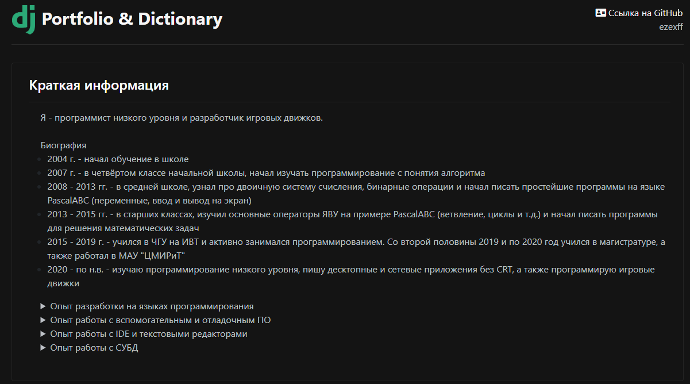

# Portfolio and Dictionary
Проект на Django, включающий в себя два приложения
- Персональное портфолио


- Словарь


## Запуск проекта
1.  Установить Django и django-grappelli
```
pip install Django
pip install django-grappelli
```
2.  Выполнить в **cmd** команду для запуска сервера из папки [code/myfirst/](code/myfirst/)
>python manage.py runserver

## Спецификация
- Python version 3.10.2
- Django version 4.0.4
